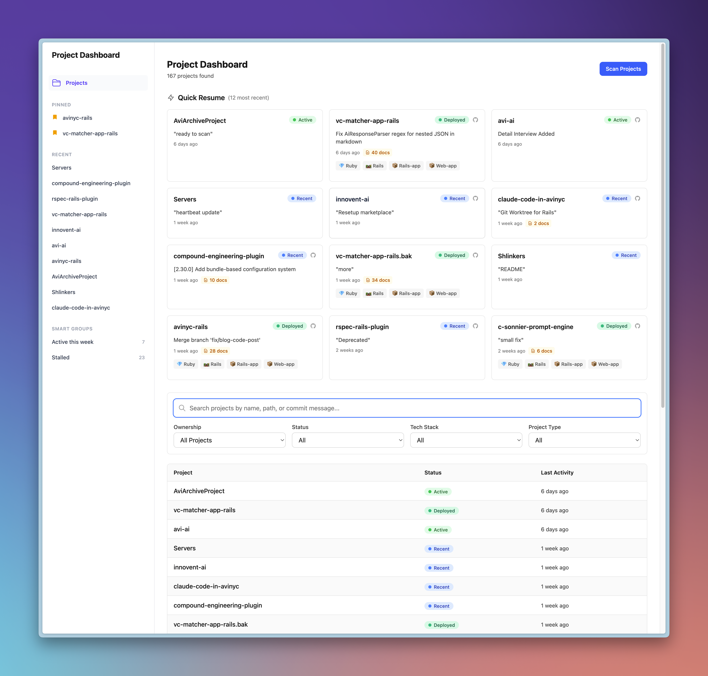

# Your Project Dashboard

A Rails 8.2 application that automatically discovers, analyzes, and tracks all active git repositories in your local development environment.

**Problem:** When you're juggling dozens of active projects across multiple directories, it's hard to remember what exists, what's active, and where things are.

**Solution:** Automated project discovery and intelligent metadata extraction. One command gives you a complete inventory of your development work, with a web dashboard to browse and manage it all.



## Features

- **Automatic git repo discovery** -- recursively scans your development directories
- **Rich metadata extraction** -- tech stack, commit history, contributors, deployment status, documentation inventory
- **Web dashboard** -- browse, filter, search, and sort all your projects
- **Quick Resume cards** -- jump back into your most recently active work
- **Left rail navigation** -- pinned projects, recently viewed, smart groups (active this week, stalled)
- **Project detail pages** -- full metadata, tags, notes, and goals per project
- **Ownership tracking** -- distinguishes your projects from forks
- **Flexible JSON metadata** -- new fields added without migrations

## Quick start

```bash
bin/setup
bin/rails db:migrate
bin/rake projects:scan
bin/dev
```

Then open [http://localhost:3000](http://localhost:3000).

## Requirements

- Ruby 3.4+
- SQLite3
- Git

## Usage

### Scan your projects

```bash
bin/rake projects:scan                              # Full scan and save
DRY_RUN=true bin/rake projects:scan                 # Preview without saving
SCAN_ROOT_PATH=~/code bin/rake projects:scan        # Custom directory
SCAN_CUTOFF_DAYS=180 bin/rake projects:scan         # 6 months instead of 8
bin/rake projects:config                            # Show configuration
```

### Start the web dashboard

```bash
bin/dev
```

### Query from the console

```bash
bin/rails console
```

```ruby
Project.order(last_commit_date: :desc)
Project.where("metadata ->> 'inferred_type' = ?", "rails-app")
Project.active_this_week
Project.pinned
Project.search("my-project")
```

## Configuration

| Variable | Default | Description |
|----------|---------|-------------|
| `SCAN_ROOT_PATH` | `~/Development` | Root directory to scan |
| `SCAN_CUTOFF_DAYS` | `240` (8 months) | Repositories older than this are skipped |
| `DRY_RUN` | `false` | If `true`, scan but don't save |

## Architecture

```
Rake Task --> ProjectScanner --> ProjectData --> Project Model --> SQLite --> Web Dashboard
```

- **ProjectScanner** (`lib/project_scanner.rb`) -- discovers repos, orchestrates scanning
- **ProjectData** (`lib/project_data.rb`) -- extracts metadata via git commands and file analysis
- **Project** (`app/models/project.rb`) -- ActiveRecord model with JSON metadata column
- **Filterable** (`app/controllers/concerns/filterable.rb`) -- search, filter, and sort logic

The `metadata` JSON column stores tech stack, commit history, contributors, deployment status, documentation inventory, and more -- no migrations needed when adding new fields.

## Tech stack

- **Ruby 3.4** / **Rails 8.2**
- **SQLite3** -- local-first, no external dependencies
- **Tailwind 4** + **Hotwire** (Turbo + Stimulus)
- **Propshaft** + **Importmap**
- **Solid Queue** / **Solid Cache**
- **Kaminari** -- pagination

## Documentation

- **[Getting Started](docs/GETTING_STARTED.md)** -- Installation, first scan, launching the dashboard
- **[Scanning](docs/SCANNING.md)** -- Configuration, metadata extraction, tech stack detection
- **[Web Dashboard](docs/WEB_DASHBOARD.md)** -- Filtering, search, tags, notes, goals, pinned projects
- **[Architecture](docs/ARCHITECTURE.md)** -- Data flow, database schema, design decisions, extending the scanner

## License

MIT
